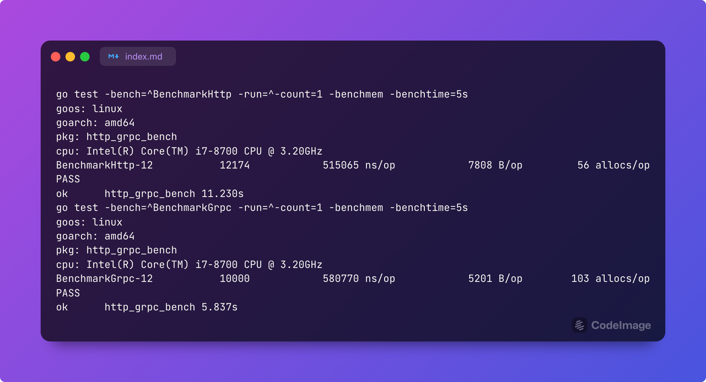
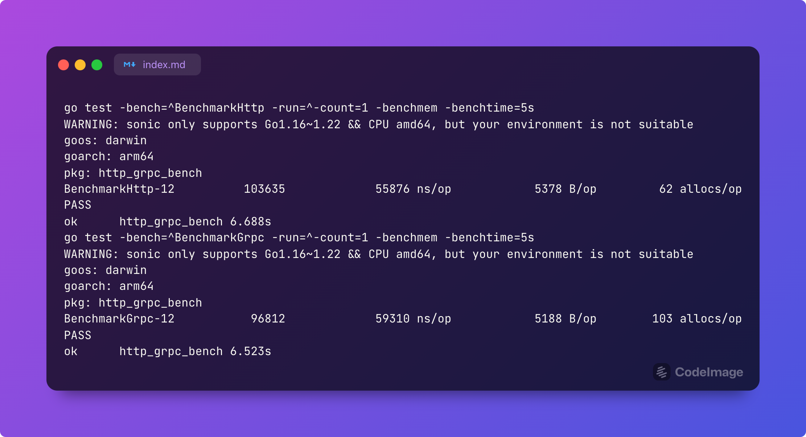

# Http Grpc Benchmark

code is mainly from [倒反天罡，http比grpc还快一倍！](https://mp.weixin.qq.com/s?__biz=Mzk0NzEwNTU2OQ==&mid=2247484098&idx=1&sn=17fa74214fb4135d1dc946e295f4f390&chksm=c37ab88cf40d319a805e511906700412be5eaa12fa05b833ddb19a04564cb150be6fff525d25)

but the result is quite different

http on json is 7~12% faster than grpc 

# Result

## Debian GNU/Linux 12 (bookworm) x86_64 Intel i7-8700 (12) @ 4.600GHz

## macOS 14.4 23E214 arm64 Apple M2 Pro

